# Emoji Nook

<p align="center">
  
</p>

A native Linux emoji picker built with Tauri v2 and React 19, designed to blend seamlessly with GNOME, KDE, and other desktop environments.

Emoji Nook runs in the background and pops up on a global shortcut, letting you search for and select an emoji that gets injected into the previously focused application. The picker adapts to your desktop's colour scheme, accent colour, and font preferences via `xdg-desktop-portal`.

> **Status:** Early development — the picker UI, theme detection, global shortcuts, emoji injection, settings persistence, and system tray are functional. CI is in place, and release automation is being built out now.

## Architecture

This repository is a `pnpm` + Cargo workspace monorepo.

- `apps/emoji-picker/` — React 19 + TypeScript frontend
- `apps/emoji-picker/src-tauri/` — Rust/Tauri v2 backend
- `plugins/xdg-portal/` — Custom Tauri plugin bridging `xdg-desktop-portal` via `ashpd`
- `plugins/xdg-portal/guest-js/` — TypeScript guest API for the plugin

### Key dependencies

| Layer     | Library                                                   | Purpose                                    |
| --------- | --------------------------------------------------------- | ------------------------------------------ |
| Emoji     | [Frimousse](https://github.com/liveblocks/frimousse) v0.3 | Headless, React 19 compatible emoji picker |
| Portal    | [ashpd](https://github.com/bilelmoussaoui/ashpd)          | D-Bus interface to `xdg-desktop-portal`    |
| Framework | [Tauri](https://v2.tauri.app/) v2                         | Desktop application shell                  |
| Clipboard | [arboard](https://crates.io/crates/arboard)               | Cross-platform clipboard access            |
| Settings  | tauri-plugin-store                                        | Persistent JSON key-value store            |
| Autostart | tauri-plugin-autostart                                    | XDG autostart desktop file management      |
| Logging   | tauri-plugin-log                                          | Structured logging with console bridge     |

### Desktop theme support

The picker reads your desktop's colour scheme, accent colour, and environment from `xdg-desktop-portal` Settings and applies a matching token set:

- **Adwaita** — GNOME, Cinnamon, MATE, XFCE (Cantarell font, rounded corners)
- **Breeze** — KDE Plasma (Noto Sans font, tighter radii)

Falls back to CSS `prefers-color-scheme` when portal access is unavailable.

## Getting started

### Prerequisites

- Node.js 20+
- `pnpm`
- Rust (stable)
- Linux system dependencies for Tauri v2:
  ```
  libwebkit2gtk-4.1-dev build-essential libssl-dev libgtk-3-dev
  libayatana-appindicator3-dev librsvg2-dev
  ```

### Runtime dependencies

Emoji injection requires a keystroke simulation tool. Install one (or more) for your environment:

| Tool      | Scope                                            | Install                                               |
| --------- | ------------------------------------------------ | ----------------------------------------------------- |
| `ydotool` | Primary — kernel `/dev/uinput`, works everywhere | `sudo pacman -S ydotool` / `sudo apt install ydotool` |
| `wtype`   | Wayland fallback (Sway, Hyprland — not GNOME)    | `sudo pacman -S wtype` / `sudo apt install wtype`     |
| `xdotool` | X11/XWayland fallback                            | `sudo pacman -S xdotool` / `sudo apt install xdotool` |

`ydotool` also needs the `input` group and user service — see [docs/linux-setup.md](docs/linux-setup.md) for full instructions, or run:

```bash
./scripts/setup-linux.sh
```

### Setup

```bash
pnpm install
```

### Run

```bash
pnpm tauri:dev
```

### Build

```bash
pnpm tauri:build
```

## Releasing

Release policy and maintainer workflow live in [docs/releasing.md](docs/releasing.md). Public GitHub release automation is still being implemented, but the versioning model, tag format, and release branch policy are now defined there so documentation and future tooling stay aligned.

## Licence

Dual-licenced under [Apache 2.0](https://www.apache.org/licenses/LICENSE-2.0) or [MIT](https://opensource.org/licenses/MIT), at your option.

(c) 2026 Liminal HQ, Scott Morris
