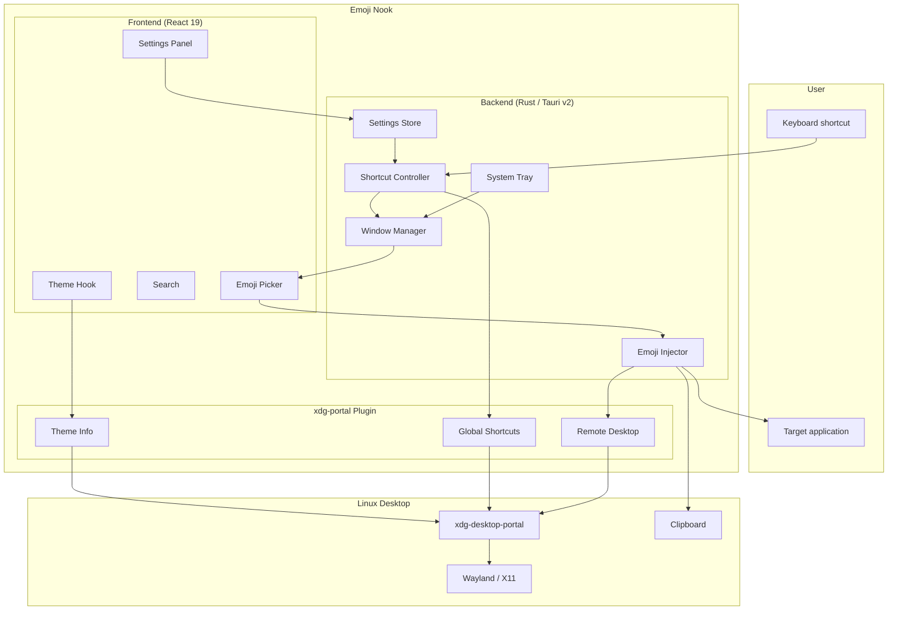
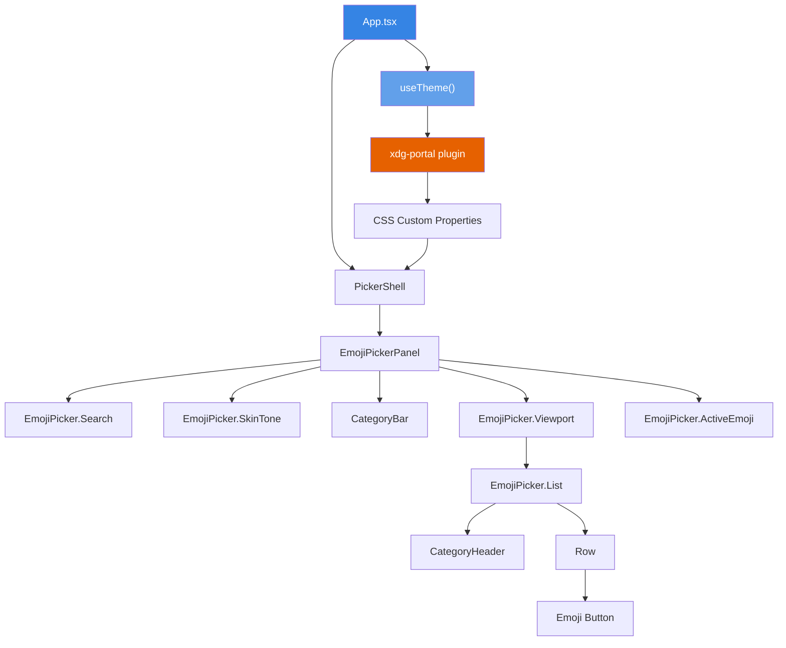
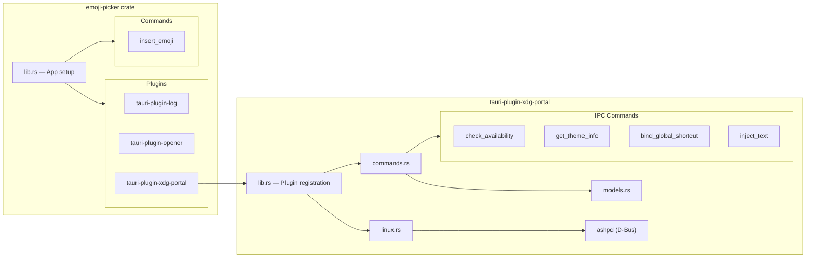
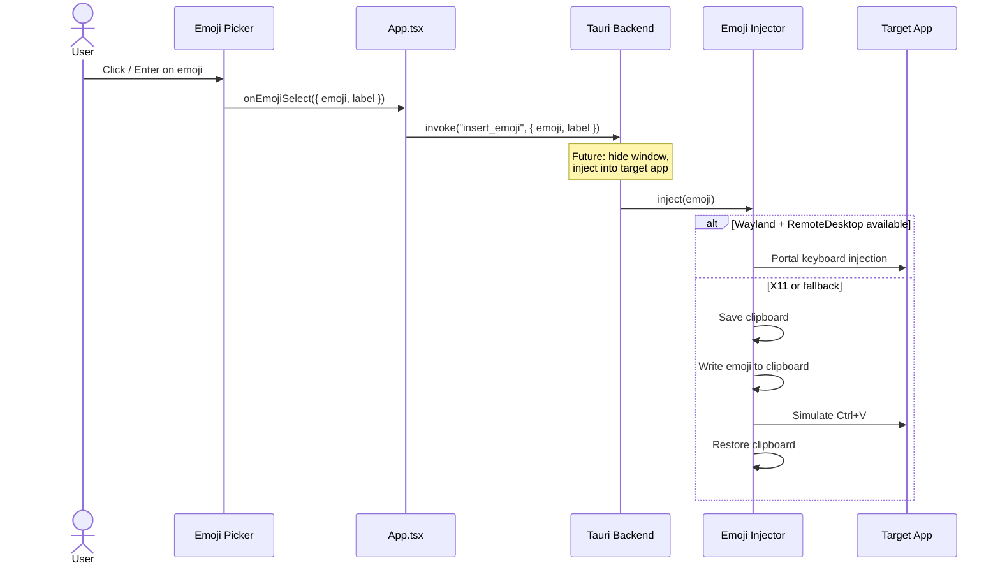
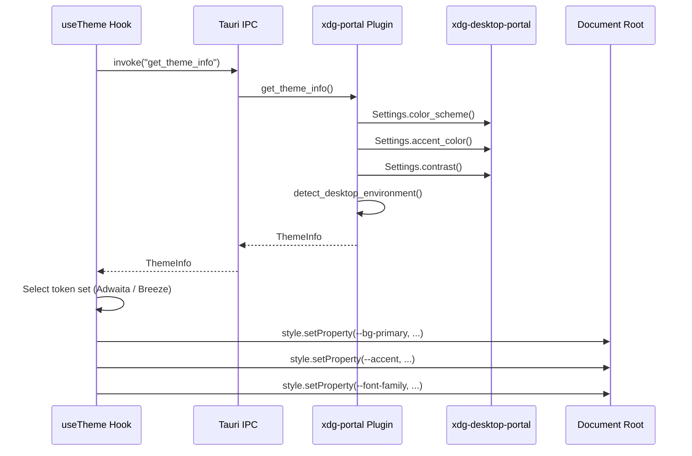
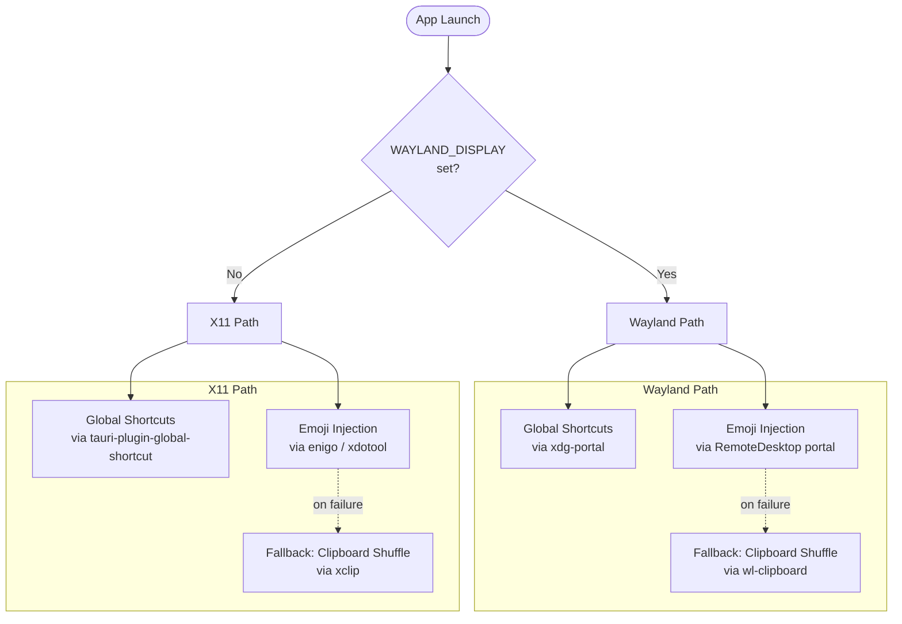
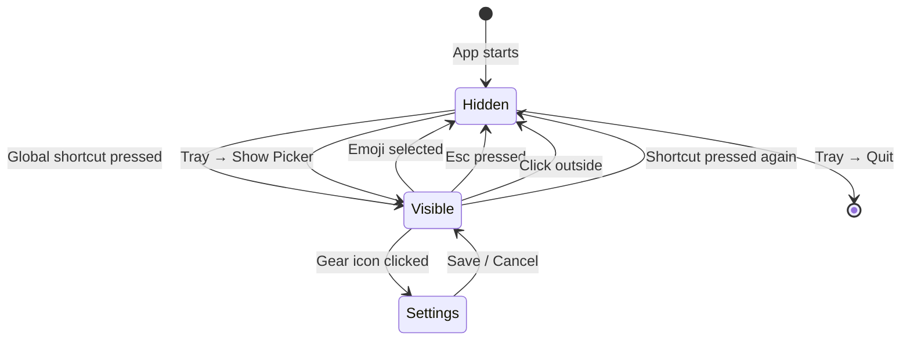
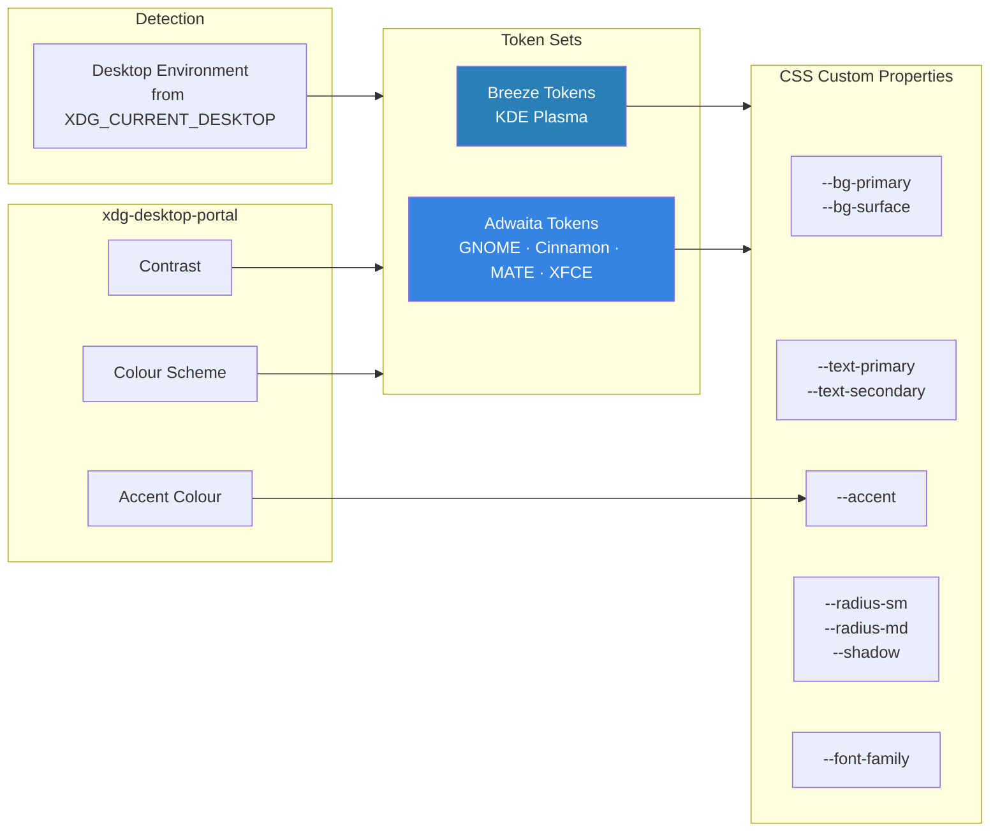

# Architecture

This document describes the high-level architecture of Emoji Nook: how the pieces fit together, how data flows through the system, and how the application adapts to Linux display server environments.

## System Overview

Emoji Nook is a system-wide emoji picker that runs as a background process on Linux. It surfaces a compact overlay window on a global shortcut, lets the user search and select an emoji, then injects it into the previously focused application.



## Component Architecture

### Frontend (React 19 + TypeScript)

The frontend is a single-page app rendered inside a Tauri webview. It's structured as a set of composable components around the Frimousse headless emoji picker.



### Backend (Rust / Tauri v2)

The Rust backend manages the application lifecycle, system tray, shortcut registration, and emoji injection. It delegates Linux-specific portal operations to the xdg-portal plugin.



## Data Flow

### Emoji Selection Flow

> **Visual:** See the [animated pipeline diagram](images/emoji_selection_pipeline.svg) for a visual overview of this flow.

This sequence shows what happens from the moment a user picks an emoji to the moment it appears in their target application.



### Theme Detection Flow

On startup, the frontend fetches the desktop theme from the xdg-portal plugin and injects CSS custom properties to match the native look.



## Display Server Adaptation

Emoji Nook detects the display server at startup and routes operations through the appropriate backend. This is critical because Wayland's security model prevents the direct input injection and shortcut listening that X11 allows.



## Window Lifecycle

The picker window has a simple three-state lifecycle. It is created once at startup and never destroyed — only shown and hidden to avoid re-creation cost.



## Native Theming

> **Visual:** See the [animated theme detection diagram](images/theme_detection_flow.svg) for a visual overview of this pipeline.

The picker adapts its appearance to the host desktop environment by reading theme properties via `xdg-desktop-portal` and mapping them to CSS custom properties.



## Directory Structure

```
emoji-nook/
├── apps/
│   └── emoji-picker/
│       ├── src/                    # React frontend
│       │   ├── components/         # Picker UI components
│       │   ├── hooks/              # useTheme, useSettings
│       │   └── utils/              # Logger bridge
│       └── src-tauri/              # Rust backend
│           ├── src/                # App commands and setup
│           └── capabilities/       # Tauri v2 permission grants
├── plugins/
│   └── xdg-portal/
│       ├── src/                    # Rust plugin (commands, models, linux)
│       ├── guest-js/               # TypeScript API bindings
│       ├── dist-js/                # Pre-built JS bindings
│       └── permissions/            # Plugin permission definitions
└── docs/
    ├── architecture.md             # ← You are here
    └── implementation-plans/       # Phased implementation plans
```
