# Architecture

This document describes the high-level architecture of Emoji Nook: how the pieces fit together, how data flows through the system, and how the application adapts to Linux display server environments.

## System Overview

Emoji Nook is a system-wide emoji picker that runs as a background process on Linux. It surfaces a compact overlay window on a global shortcut, lets the user search and select an emoji, then injects it into the previously focused application via a clipboard shuffle technique.

<p align="center">
  
</p>

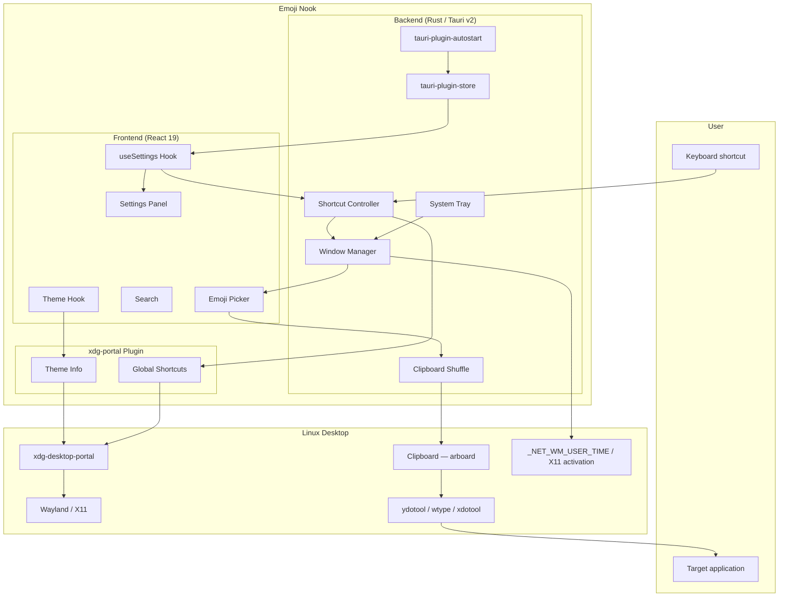

## Component Architecture

### Frontend (React 19 + TypeScript)

The frontend is a single-page app rendered inside a Tauri webview. It's structured as a set of composable components around the Frimousse headless emoji picker, with a settings panel that replaces the picker view when open.

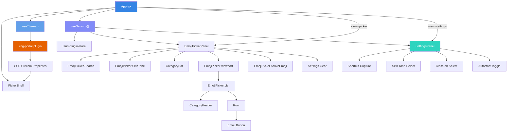

### Backend (Rust / Tauri v2)

The Rust backend manages the application lifecycle, system tray, shortcut registration, and emoji injection. It delegates Linux-specific portal operations to the xdg-portal plugin and X11 activation quirks to the desktop-integration plugin.

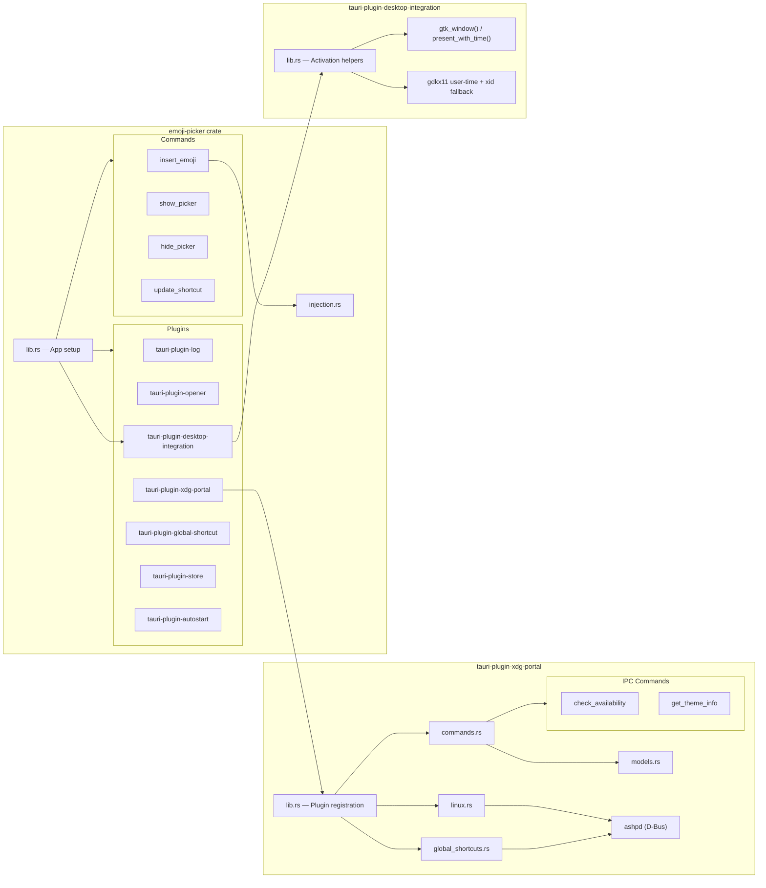

## Data Flow

### Emoji Selection Pipeline

> **Visual:** See the [animated pipeline diagram](images/emoji_selection_pipeline.svg) for a visual overview of this flow.

This sequence shows what happens from the moment a user picks an emoji to the moment it appears in their target application.

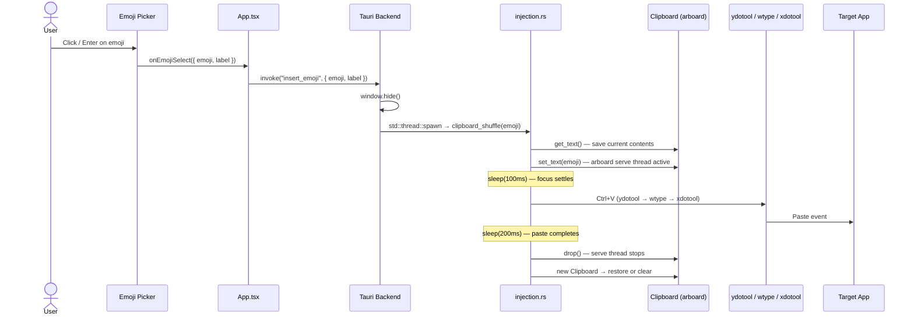

### Clipboard Shuffle Detail

> **Visual:** See the [animated clipboard shuffle diagram](images/clipboard_shuffle.svg) for a detailed visual of this flow.

The clipboard shuffle is the primary injection mechanism. It works on both Wayland and X11 by leveraging kernel-level input simulation.

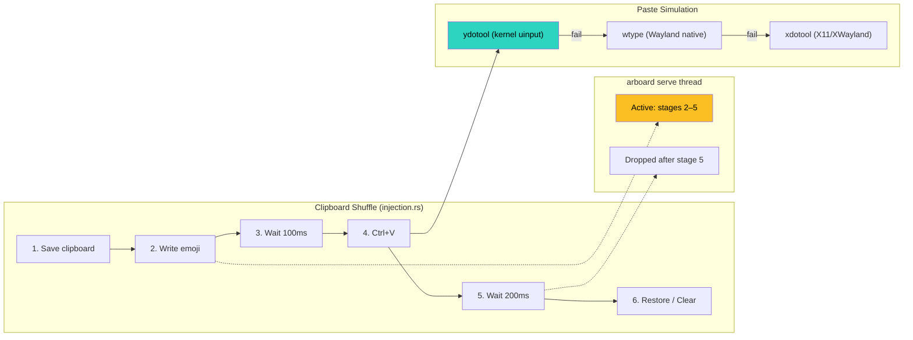

### Theme Detection Flow

> **Visual:** See the [animated theme detection diagram](images/theme_detection_flow.svg) for a visual overview of this pipeline.

The picker adapts its appearance to the host desktop environment by reading theme properties via `xdg-desktop-portal` and mapping them to CSS custom properties. Because the picker window is recreated on each activation, theme info is fetched on mount for every fresh window.

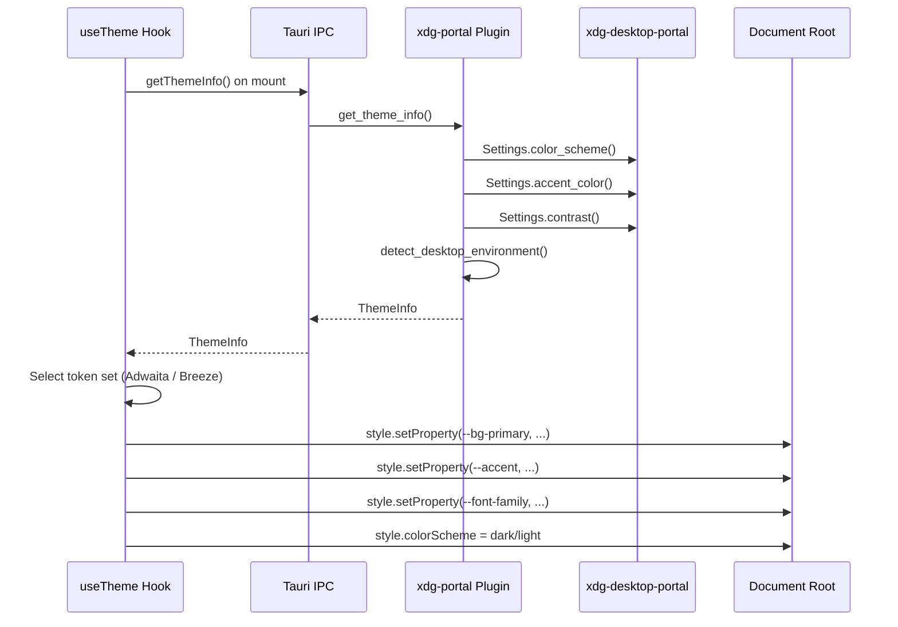

### Settings Persistence Flow

> **Visual:** See the [animated settings diagram](images/settings_persistence.svg) for a visual overview of this flow.

Settings are persisted via `tauri-plugin-store` as a local JSON file and applied on startup and on save.

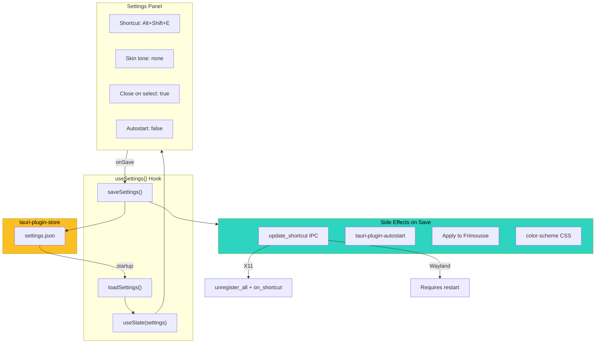

## Display Server Adaptation

> **Visual:** See the [animated display server routing diagram](images/display_server_routing.svg) for a detailed visual of the Wayland vs X11 paths.

Emoji Nook detects the display server at startup by checking the `WAYLAND_DISPLAY` environment variable and routes operations through the appropriate backend.

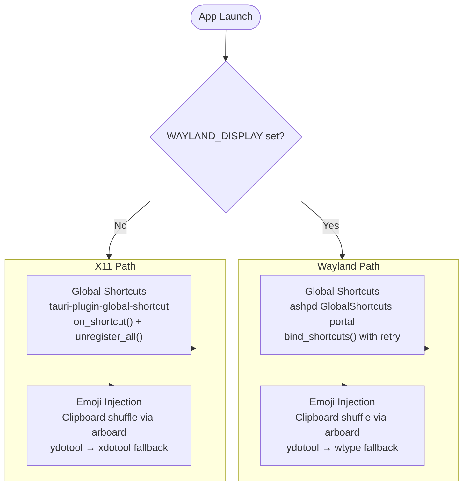

## Window Lifecycle

> **Visual:** See the [animated window lifecycle diagram](images/window_lifecycle.svg) for an interactive state machine view.

The picker window has a simple three-state lifecycle. The app process stays resident in the tray, but the picker window itself is disposable and recreated for each activation under a fresh `picker-*` label.

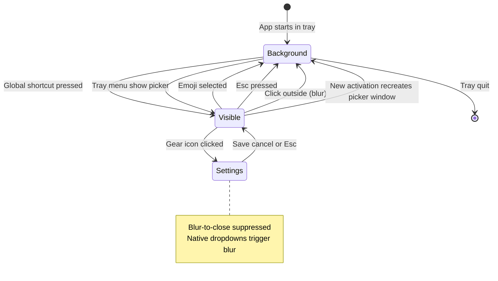

### Window Configuration

The picker window is configured as a frameless overlay template in Rust. The app starts without any picker window, and later activations create fresh `picker-*` windows with the same overlay properties:

| Property      | Value     | Purpose                            |
| ------------- | --------- | ---------------------------------- |
| Startup       | none      | Tray-first process with no window  |
| `decorations` | `false`   | Frameless                          |
| `transparent` | `true`    | Rounded corners float over desktop |
| `alwaysOnTop` | `true`    | Stays above other windows          |
| `center`      | `true`    | Centred on screen                  |
| `resizable`   | `false`   | Fixed compact size                 |
| `skipTaskbar` | `true`    | Background process, tray-only      |
| Size          | 370 x 380 | Compact picker dimensions          |

On X11, each fresh picker window is also handed to the desktop-integration plugin. The plugin asks GTK to `present_with_time(...)` and stamps `_NET_WM_USER_TIME` via `gdkx11` so Cinnamon/Muffin receives a native activation timestamp for the fresh picker window.

## Native Theming

> **Visual:** See the [animated theme detection diagram](images/theme_detection_flow.svg) for a visual overview of this pipeline.

The picker adapts its appearance to the host desktop environment by reading theme properties via `xdg-desktop-portal` and mapping them to CSS custom properties.

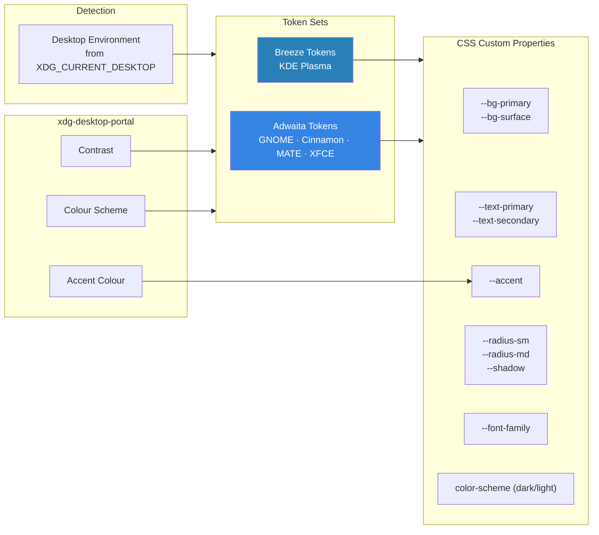

Theme info is fetched whenever a fresh picker window mounts. The `color-scheme` CSS property is set on the document root so native form controls (selects, checkboxes) match the detected theme.

## System Tray

The app provides a system tray icon with a context menu:

- **Show Picker** — recreates and focuses a fresh picker window
- **Quit** — exits the application

The tray uses the default app icon and the tooltip "Emoji Nook". The tray provides a fallback for showing the picker when global shortcuts are unavailable (e.g. portal permission denied on Wayland).

## Directory Structure

```
emoji-nook/
├── apps/
│   └── emoji-picker/
│       ├── src/                    # React frontend
│       │   ├── components/         # UI components
│       │   │   ├── EmojiPickerPanel.tsx   # Main picker (Frimousse)
│       │   │   ├── PickerShell.tsx        # Compact container
│       │   │   ├── CategoryBar.tsx        # Category tab bar
│       │   │   └── SettingsPanel.tsx       # Settings UI
│       │   ├── hooks/              # React hooks
│       │   │   ├── useTheme.ts            # Portal theme detection
│       │   │   └── useSettings.ts         # Settings persistence
│       │   ├── utils/              # Logger bridge
│       │   ├── App.tsx             # Root view, view routing, lifecycle
│       │   └── App.css             # All styles + CSS custom properties
│       └── src-tauri/              # Rust backend
│           ├── src/
│           │   ├── lib.rs                 # Setup, tray, shortcuts, commands
│           │   └── injection.rs           # Clipboard shuffle
│           └── capabilities/              # Tauri v2 permission grants
├── plugins/
│   ├── desktop-integration/
│   │   └── src/                    # Rust plugin
│   │       └── lib.rs              # X11 activation + user-time helpers
│   └── xdg-portal/
│       ├── src/                    # Rust plugin
│       │   ├── lib.rs                     # Plugin registration
│       │   ├── commands.rs                # IPC commands
│       │   ├── models.rs                  # ThemeInfo, Availability types
│       │   ├── linux.rs                   # ashpd D-Bus integration
│       │   ├── global_shortcuts.rs        # Portal shortcut session
│       │   └── remote_desktop.rs          # (stub) Future use
│       ├── guest-js/               # TypeScript API bindings
│       ├── dist-js/                # Pre-built JS bindings
│       └── permissions/            # Plugin permission definitions
├── docs/
│   ├── architecture.md             # ← You are here
│   ├── linux-setup.md              # System dependency setup guide
│   ├── images/                     # Animated SVG diagrams
│   └── implementation-plans/       # Phased implementation plans
└── scripts/
    └── setup-linux.sh              # Auto-install script
```

## Key Dependencies

| Layer           | Library                                                   | Purpose                                 |
| --------------- | --------------------------------------------------------- | --------------------------------------- |
| Emoji           | [Frimousse](https://github.com/liveblocks/frimousse) v0.3 | Headless React 19 emoji picker          |
| Portal          | [ashpd](https://github.com/bilelmoussaoui/ashpd)          | D-Bus interface to `xdg-desktop-portal` |
| Framework       | [Tauri](https://v2.tauri.app/) v2                         | Desktop application shell               |
| Clipboard       | [arboard](https://crates.io/crates/arboard)               | Cross-platform clipboard access         |
| Settings        | tauri-plugin-store                                        | Persistent JSON key-value store         |
| Autostart       | tauri-plugin-autostart                                    | XDG autostart desktop file management   |
| Shortcuts (X11) | tauri-plugin-global-shortcut                              | X11 global shortcut registration        |
| Activation      | tauri-plugin-desktop-integration                          | Native X11 user-time activation         |
| Logging         | tauri-plugin-log                                          | Structured logging with console bridge  |

### Runtime Dependencies

Emoji injection requires a keystroke simulation tool:

| Tool      | Scope                             | Mechanism               |
| --------- | --------------------------------- | ----------------------- |
| `ydotool` | Primary — works everywhere        | Kernel `/dev/uinput`    |
| `wtype`   | Wayland fallback (Sway, Hyprland) | Native Wayland protocol |
| `xdotool` | X11/XWayland fallback             | X11 protocol            |

## Known Limitations

- **Window dragging** does not work on WebKitGTK — see [#5](https://github.com/liminal-hq/emoji-nook/issues/5)
- **Wayland shortcut changes** require app restart (portal session cannot be re-bound dynamically)
- **Wayland shortcut from non-IDE terminals** may fail due to D-Bus session context differences
- **Live theme changes** are not detected in real-time — theme is re-fetched on each picker show
- **RemoteDesktop portal injection** is deferred — clipboard shuffle is used for all injection
